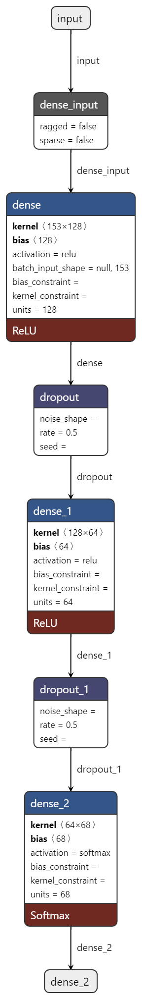

## Cat-Disease-Chabot
An AI Chatbot implementing the knowledge of Natural Language Processing techniques. Users can ask questions about the disease suffered by their beloved cats. It is a web-based AI Chatbot integrated using Flask framework.

# Model architecture of the chatbot:

# Flowchat of the overall system:
1. Train the chatbot model
2. Get input from user
3. Process the sentences
4. If confidence level more than 80% output most accurate responses
5. Else, output "I do not understand"

# GUI of the Cat Disease Chatbot:

